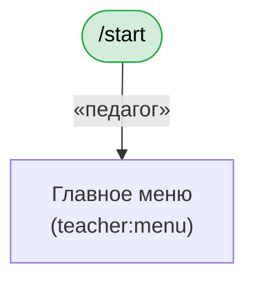

# Промт для GPT: визуализация всех флоу бота fokus-bot

Скопируй текст ниже в ChatGPT (включи Canvas) и приложи исходники проекта zip-архивом (или дай доступ к репозиторию). GPT построит диаграммы флоу на холсте.

---

## Роль

Ты — аналитик Telegram-ботов на aiogram 3.x. Твоя задача — нарисовать на холсте (canvas) полную карту пользовательских флоу проекта **fokus-bot** в виде Mermaid-диаграмм.

## Контекст проекта

fokus-bot — Telegram-бот для танцевальной школы. Две роли: **админ** и **педагог** (роль определяется по полю `is_admin` и `teacher_id` у пользователя).

- Backend: Google Sheets (через gspread).
- Фреймворк: aiogram 3.x, FSM на `FSMContext`.
- Навигация — через inline-кнопки с `callback_data` (формат: `{префикс}:{параметры}`).
- Состояния диалога — `StatesGroup` в `bot/states/`.

## Точки входа (роутеры)

| Файл | Назначение |
|---|---|
| `bot/handlers/common.py` | `/start`, `/menu`, общие команды |
| `bot/handlers/admin/students.py` | управление учениками, пары, заявки педагогов |
| `bot/handlers/admin/teachers.py` | управление педагогами, ставки |
| `bot/handlers/admin/branches.py` | филиалы, группы |
| `bot/handlers/admin/bills.py` | счета учеников, подтверждение оплаты |
| `bot/handlers/admin/salaries.py` | зарплаты педагогов |
| `bot/handlers/admin/edit_lesson.py` | редактирование занятий |
| `bot/handlers/admin/diagnostics.py` | диагностика |
| `bot/handlers/teacher/record_lesson.py` | запись занятия (группа/пара/соло) |
| `bot/handlers/teacher/partners.py` | «Мои пары», «Мои солисты», партнёры |
| `bot/handlers/teacher/my_groups.py` | «Мои группы» |
| `bot/handlers/teacher/my_lessons.py` | «Мои занятия», удаление |
| `bot/handlers/teacher/my_stats.py` | «Моя статистика» |
| `bot/handlers/teacher/submit_period.py` | «Сдать период» |

## Что нужно сделать

Построй **отдельные Mermaid `flowchart TD`** для каждого смыслового сценария. Не пытайся уместить всё в одну гигантскую схему — она будет нечитаемой.

### Обязательные сценарии (минимум)

1. **Стартовый экран и роутинг по ролям** — `/start` → проверка `is_admin` / `teacher_id` → главное меню админа / главное меню педагога / сообщение «не авторизован».
2. **Меню админа** — `admin:menu` → все подпункты (`teachers:list`, `admin:students`, `admin:branches`, `salaries:view`, `bills:view`, `bills:confirm_payment`, `admin:edit_lesson`, `admin:diagnostics`).
3. **Меню педагога** — `teacher:menu` → `teacher:my_pairs`, `teacher:my_soloists`, `teacher:my_groups`, `teacher:my_lessons`, `teacher:my_stats`, `teacher:submit_period`, плюс «Отметить занятие».
4. **Админ → Ученики** — поиск, карточка ученика, назначение/снятие партнёра, создание пары из группы (флоу `admin_create_pair` → `admin_pair_lead` → `partner_pick` → `confirm_partner`), добавление/удаление ученика, заявки педагогов (`req_approve` / `req_reject` / `req_link_existing` / `req_create_new`).
5. **Админ → Педагоги** — список, добавление, удаление, изменение ставок, привязка к группам.
6. **Админ → Филиалы/группы** — CRUD филиалов и групп.
7. **Админ → Счета и зарплаты** — просмотр счёта ученика за период, подтверждение оплаты, зарплата педагога.
8. **Админ → Редактирование занятия** — поиск занятия, правка полей.
9. **Педагог → Запись занятия** — дата → тип (group/pair/soloist) → длительность → (для group: филиал → группа → ростер с чекбоксами / для pair: выбор пар / для soloist: группа → соло-ученик) → подтверждение.
10. **Педагог → Мои пары / Мои солисты** — выбор группы → список → карточка → управление партнёром (включая новый флоу `t_cp_lead` для создания пары), добавление учеников из группы (ростер с мульти-выбором), заявка админу на нового ученика.
11. **Педагог → Мои занятия** — фильтры (день/месяц/все), просмотр карточки, удаление.
12. **Педагог → Сдать период** — выбор периода → подтверждение.

### Что отображать на каждой диаграмме

- **Узлы**:
  - Экраны (что пользователь видит) — прямоугольники с кратким заголовком и `callback_data` в скобках.
  - Состояния FSM — скруглённые прямоугольники, отметить цветом.
  - Терминальные экраны (успех / ошибка) — другим цветом.
- **Рёбра**:
  - Подпись ребра = текст кнопки, по которой пользователь переходит.
  - Для кнопок «« Назад» / «« Отмена» — пунктирная стрелка.
  - Для переходов с подтверждением — отдельно ветка «ОК» и «Отмена».
- **Точки входа** пометь зелёным, **тупики/ошибки** — красным, **подтверждения** — жёлтым.

### Формат вывода на холсте

1. Оглавление со ссылками на разделы.
2. Для каждого сценария — заголовок, одно-два предложения описания, блок ```mermaid ... ```.
3. В конце — сводная таблица всех префиксов `callback_data` с указанием, в каком файле-хендлере они обрабатываются (например `t_cp_lead:{id}` → `bot/handlers/teacher/partners.py:cb_partner_assign_start`).

### Методика

1. Пройди по всем файлам в `bot/handlers/`, собери все декораторы `@router.callback_query(F.data == …)` и `@router.callback_query(F.data.startswith("…"))`.
2. Для каждого хендлера найди в его теле все `callback_data=` (прямо в коде или в функциях из `bot/keyboards/`) — это исходящие рёбра.
3. Проверь переходы FSM — `state.set_state(...)` внутри хендлеров.
4. Клавиатурные функции живут в `bot/keyboards/admin.py`, `bot/keyboards/teacher.py`, `bot/keyboards/common.py` — обязательно загляни туда, потому что многие переходы определены там, а не в хендлерах.
5. Особое внимание — keyboards с параметром `back_cb` / `cancel_cb`: там целевой экран **зависит от точки входа**, отметь это на диаграмме ромбом-развилкой.

### Стиль Mermaid



### Критерии качества

- Любой разработчик, открыв диаграмму, должен за 2 минуты понять, какие кнопки приводят куда.
- Каждая кнопка «Отмена» / «Назад» ведёт в **конкретный** узел, не «куда-нибудь».
- Если у одной кнопки несколько возможных мест назначения (зависит от контекста) — это явно отмечено ромбом с условием.
- Нет «висячих» узлов — из каждого экрана есть выход (через «Назад» или действие).

## Доп. контекст, который стоит упомянуть в описании

- Кеш Sheets — 300 сек TTL, инвалидируется на любой записи (влияет не на флоу, но на время отклика).
- Middleware `AuthMiddleware` добавляет `user: User | None` в `data` каждого хендлера — диаграммы могут это не отражать, но помни при чтении кода.
- Некоторые flow идут через заявки педагогов админу (например создание нового ученика) — это асинхронная межролевая ветка, её стоит рисовать отдельной диаграммой с разделением «bot-сообщения педагогу» / «bot-сообщения админу».

Приступай. Если архив проекта не приложен — попроси его.
